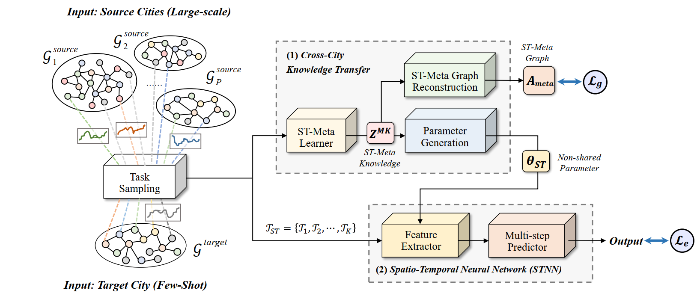

# Spatio-Temporal Graph Few-Shot Learning with Cross-City Knowledge Transfer


## Requirements
- torch >= 1.8.1
- numpy >= 1.20.3
- scikit-learn >= 0.24.2
- pytorch geometric >= 1.7.2
- pyaml
- scipy
- tqdm

## Data
- Download the data from [google drive](https://drive.google.com/file/d/16xbiRvh5jJx2A4Swv9dEMEz_Y0AEoQTM/view?usp=sharing)

## Model training & Testing
```bash
# Set the test dataset and model structure
CUDA_VISIBLE_DEVICES=[CUDA NUM] python main.py --test_dataset [FEW-SHOT DATASET] --model [ST-META MODEL]
# For example: Use GRU model to train a model, and test on PEMS-BAY datasets
CUDA_VISIBLE_DEVICES=0 python main.py --test_dataset pems-bay --model GRU
```

## Citation
If you find this repository, e.g., the paper, code and the datasets, useful in your research, please cite the following paper:
```
@inproceedings{DBLP:conf/cikm/LuGJFZ20,
  author    = {Bin Lu and
               Xiaoying Gan and
               Weinan Zhang and
               Huaxiu Yao abd
               Luoyi Fu and
               Xinbing Wang},
  title     = {Spatio-Temporal Graph Few-Shot Learning with Cross-City Knowledge Transfer},
  booktitle = {{KDD} '22: The 28th {ACM} SIGKDD Conference on Knowledge Discovery and Data Mining,
              Washington, DC, USA, August 14--18, 2022},
  publisher = {{ACM}},
  year      = {2022}
}
```
